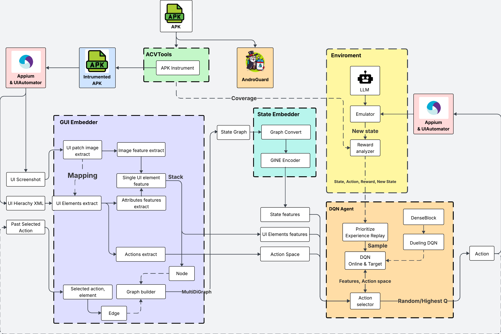

# 🤖 DACN : Automatic black-box testing ultilizing reinforcement learning for Android application

## 📱 Overview

An automated mobile application testing framework combining Deep Q-Learning with GINE for graph feature extraction and CNN for Image patching for efficient test action selection and execution. This model is inspired by the paper [Deep Reinforcement Learning for Automated Android GUI Testing](https://dl.acm.org/doi/10.1145/3597503.3623344)

<p align="center">
  
</p>

## 🛠️ Dependencies & Environment

**Core Requirements**:

- Python 3.12.10
- CUDA 12.6
- PyTorch 2.6.0
- Appium 2.17.0 and Appium Python Client 5.0.0
- JDK 17.0.12

**Testing Tools**:

- Android Studio Meerkat 2024.3.1
- Android OS 7.0 (Nougat)
- [ACVTool 2.3.4 Multidex](https://github.com/pilgun/acvtool)

Full dependencies list available in `requirements.txt`

## 📥 Installation

**Setup Environment**:

```bash
git clone https://github.com/Witnull/DACN.git
cd DACN
python -m venv venv
venv/Scripts/activate
pip install -r requirements.txt
```

**Configure Environment Variables**:

```bash
export ANDROID_HOME="/path/to/android/sdk"
export JAVA_HOME="/path/to/jdk-17"
export PATH="$PATH:$ANDROID_HOME/platform-tools"
```

**Tool Installation**:

- Install Android Studio & configure SDK
- [Install Appium](https://appium.io/docs/en/latest/quickstart/install/)
- Run Appium Doctor to verify setup
- Install and setup [ACVTool](https://github.com/pilgun/acvtool)

## ⚙️ How It Works

The framework operates in three main phases:

**🚀 Initialization**

- APK instrumentation for coverage tracking
- Android emulator & Appium server startup
- Initial state analysis

**🔄 Testing Loop**

- GUI state extraction & vectorization using GNN (GINEConv) for Graph, CNN for Image patches, sentence-transformers/all-MiniLM-L6-v2 for Text features
- Action selection using Double-Dueling DQN
- Test execution via Appium - using SLM to generate test inputs (microsoft/Phi-4-mini-instruct)
- Coverage & reward calculation
- Save to Prioritized Experience Replay buffer (PER)
- Train and update DQN model
- Repeat until stopping criteria met

**📊 Results Analysis**

- Coverage
- Bug list

## 🎥 Demo:

https://github.com/user-attachments/assets/c0444c1c-e285-4fad-9120-c4cc8e203dda

## 📈 Results

The test experiment on dataset from [DQT - AndroTest24](https://github.com/Yuanhong-Lan/AndroTest24) with 5 apps and one app from F-Droid.
Each app is given 2 hrs per test model.

### 📊 Coverage Results:

<p align="center">
  
</p>

#### 🐛 Bug found by our model:

<p align="center">
  
</p>
<p align="center">
  
</p>

## 📚 References

- [Appium Documentation](https://appium.io/docs/en/2.0/)
- [ACVTool Repository](https://github.com/pilgun/acvtool)
- [Android Testing Guide](https://developer.android.com/training/testing)
- [PyTorch DQN Tutorial](https://pytorch.org/tutorials/intermediate/reinforcement_q_learning.html)
- [PyTorch GINEConv](https://pytorch-geometric.readthedocs.io/en/2.6.0/generated/torch_geometric.nn.conv.GINEConv.html)
- [sentence-transformers/all-MiniLM-L6-v2](https://huggingface.co/sentence-transformers/all-MiniLM-L6-v2)
- [microsoft/Phi-4-mini-instruct](https://huggingface.co/microsoft/Phi-4-mini-instruct)
- [DQT - Deep Reinforcement Learning for Automated Android GUI Testing](https://dl.acm.org/doi/10.1145/3597503.3623344)
- [UI/Application Exerciser Monkey](https://developer.android.com/studio/test/other-testing-tools/monkey)

---

## 🖼️ Images

### Full workflow

<p align="center">
  
</p>

### Process APKs

<p align="center">
  
</p>

### GUI Embedder

<p align="center">
  
</p>

### State Embedder

<p align="center">
  
</p>

### DQN Model

<p align="center">
  
</p>

### Environment

<p align="center">
  
</p>
